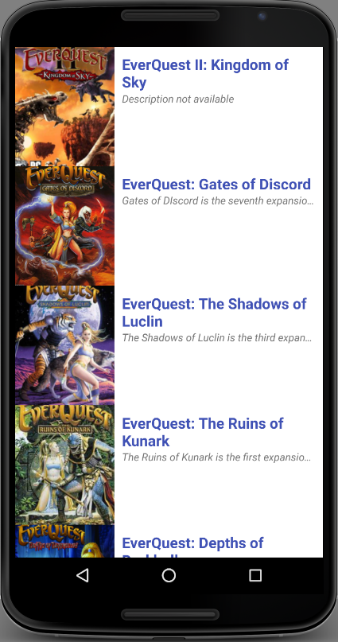

# AND-PlayedThat
An Android application to allow the user to search for games and store details about what games they have played along with some other things.

Table of contents
=================

  * [Table of contents](#table-of-contents)
  * [Project Info](#project-info)
    * [Documentation](#documentation)
  * [Installation](#installation)
  * [Specifications](#specifications)
  * [Known Bugs](#known-bugs)
  * [Contributing](#contributing)
  * [License](#license)

### Project Info

  Repository for Information about AND-PlayedThat

### Documentation

  No documentation for this exists yet.

## Setup/Installation Requirements

* Clone the repo
* Open in Android Studio
* Start Virtual Android Device
* Run App and ue on Emulator

## Specifications

| Behavior      | Example Input         | Example Output        |
| ------------- | ------------- | ------------- |
| User wants to select a button  | user clicks find games  | page advances to Search games by:   |
| User wants to search by genre  | user clicks genre selector  | page advances to select a genre:   |
| User wants to view genre  | user clicks unique genre | page advances to unique genre detail page:   |

## Known Bugs
* Contact Rich Garrick at <richg341@gmail.com>

## Contributing

1. Fork it!
2. Create your feature branch: `git checkout -b my-new-feature`
3. Commit your changes: `git commit -am 'Add some feature'`
4. Push to the branch: `git push origin my-new-feature`
5. Submit a pull request :D

## Future Features

*   Recommendations based on your personal game preferences.
*   Ratings from both the PlayedThat community and professional critics.
*   Game Guide with lots of categories and genre choices.
*   Game Picks For User based on your individual play styles.
*   Find Deals on Games across the Internet

## License
The MIT License (MIT)
Copyright 2017 Rich Garrick

Permission is hereby granted, free of charge, to any person obtaining a copy of this software and associated documentation files (the "Software"), to deal in the Software without restriction, including without limitation the rights to use, copy, modify, merge, publish, distribute, sublicense, and/or sell copies of the Software, and to permit persons to whom the Software is furnished to do so, subject to the following conditions:

The above copyright notice and this permission notice shall be included in all copies or substantial portions of the Software.

THE SOFTWARE IS PROVIDED "AS IS", WITHOUT WARRANTY OF ANY KIND, EXPRESS OR IMPLIED, INCLUDING BUT NOT LIMITED TO THE WARRANTIES OF MERCHANTABILITY, FITNESS FOR A PARTICULAR PURPOSE AND NONINFRINGEMENT. IN NO EVENT SHALL THE AUTHORS OR COPYRIGHT HOLDERS BE LIABLE FOR ANY CLAIM, DAMAGES OR OTHER LIABILITY, WHETHER IN AN ACTION OF CONTRACT, TORT OR OTHERWISE, ARISING FROM, OUT OF OR IN CONNECTION WITH THE SOFTWARE OR THE USE OR OTHER DEALINGS IN THE SOFTWARE.
